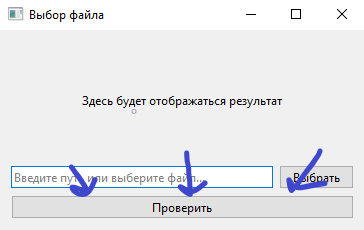

Эта программа на PyQt6 позволяет определять настоящий крокодил на фото или сгенерированный с помошью ИИ.

Просто укажите путь или выберите его кнопкой

Нажмите кнопку "Проверить"

В поле выше выведет ИИ это или нет.

